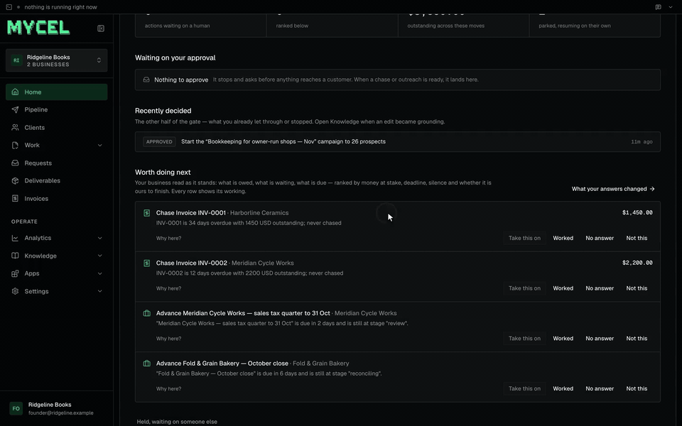
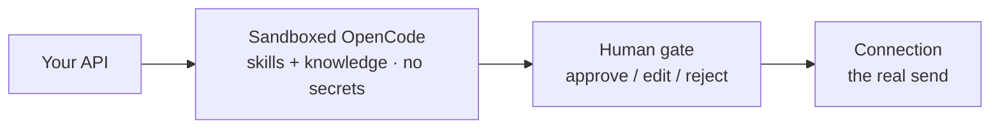
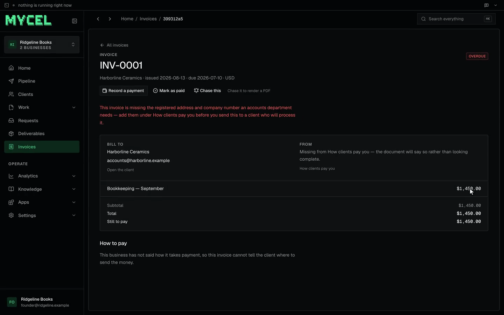

<p align="center"><strong>The open kernel for AI-native service businesses.</strong></p>
<p align="center">
  OpenCode in a sandbox. A human on every send.<br>
  Clients, cases, approvals, invoices — not another chat loop.
</p>

<p align="center">
  
</p>
<p align="center"><sub>
  Ranked next moves on <code>npm run demo:seed</code> (Ridgeline Books). Filmed on Cloud against this kernel.
  The clone is headless — Cloud is a <code>/v1</code> consumer, not in the repo.
</sub></p>

<p align="center">
  <a href="https://github.com/mycelhq/mycel/actions/workflows/ci.yml"></a>
  <a href="./LICENSE"></a>
  <a href="https://mycelai.dev"></a>
  <a href="https://github.com/mycelhq/mycel/stargazers"></a>
</p>

```bash
git clone https://github.com/mycelhq/mycel && cd mycel
npm i && npm test          # green. no keys, no Docker, no Postgres.
```

That is the whole first look. The suite drives the `/v1` contract against a mock agent in-process.
If it is red, the clone is broken — not your machine.

> **Pre-alpha.** The core is real and tested. APIs still move. Watch the repo; don't pin to it yet.
> [CHANGELOG](./CHANGELOG.md).

---

## What this is

Plenty of things run an LLM in a loop. Mycel is the **operating system around that loop** for a
firm that sells work: a client logs in, a job runs in a sandbox, nothing reaches the outside world
until a human approves, the artifact is a deliverable, the money is an invoice.

A **wedge** is a service as config — `wedge.json` + skills (how) + knowledge (what's true) — not a
fork of the engine. Bookkeeping, dunning, GEO, recruiting, and a contract desk all sit on the same
kernel.

The agent **never holds a credential.** It gets an opaque nonce. The harness holds the secret, shows
a preview, executes on approve, and writes an audit row. There is no code path from the sandbox to
the network that skips that gate.



The secret never enters the box. The host of every write comes from the connection, not from the
agent.

Hosted Cloud (invite-only) is the commercial layer: [mycelai.dev](https://mycelai.dev).
This repository is the kernel. Apache-2.0, self-host it.

## Why not the thing you already have

| | You write a graph | A chat “employee” | Mycel |
|---|---|---|---|
| Loop | LangGraph, Crew, your own | OpenClaw, Kortix, a custom agent | We don't own one. We drive [OpenCode](https://opencode.ai). |
| What you get | Nodes and state | A conversation that can use tools | **A firm:** clients, cases, waits, deliverables, invoices, a portal contract |
| Secrets | Your problem | Often in the box or the prompt | Nonce in the box. Host of every write comes from the connection. |
| Outward action | DIY | Varies | Structural gate. Policy envelopes can skip-review *inside* a declared cap; widening cannot. |
| Vertical | Prompt + tools | Prompt + tools | Wedge = manifest + skills + knowledge. One engine, many trades. |

If you want a generalist that runs your company from a chat, this is the wrong repo.
If you want the kernel under a service business you actually bill, it is the right one.

## Try it (no keys)

```bash
npm run demo         # kernel on :4000, in-memory, mock runtime
npm run demo:seed    # another shell — builds "Ridgeline Books"
```

Five clients, invoices in every state, engagements, a wait blocked on a bank statement, ranked
**moves** derived from that state. There is **no UI in this repository** — Mycel is headless. The
console at `:3000` is a separate consumer of the same contract, not part of the kernel. The GIF at
the top, and this invoice, are that consumer on this seed:

<p align="center">
  
</p>

### A business to look at

The seed writes into the **owner's** project. `/v1` is project-scoped with no default, so read it
back as the owner, with that project's id. `demo:seed` prints the same command when it finishes.

```bash
LOGIN=$(curl -s localhost:4000/v1/auth/login -H 'content-type: application/json' \
  -d '{"email":"founder@ridgeline.example","password":"demo-ridgeline"}')
TOKEN=$(echo "$LOGIN" | jq -r .token)
PROJECT=$(echo "$LOGIN" | jq -r '.projects[] | select(.name=="Ridgeline Books") | .id')

curl -s localhost:4000/v1/moves \
  -H "authorization: Bearer $TOKEN" -H "x-mycel-project: $PROJECT" | jq
```

> **`mycel_demo_key` will not show you this.** That API key is a *different tenant* — it resolves
> to its own key-derived project, so `GET /v1/moves` with it correctly returns `{"moves":[]}` even
> after a successful seed. That is tenant isolation working, not a failed seed.

A task, from curl:

```bash
curl -X POST http://localhost:4000/v1/tasks \
  -H "authorization: Bearer $MYCEL_API_KEY" -H "content-type: application/json" \
  -d '{"wedge":"books-keeper","task_type":"chase_receipts","input":{"period":"2026-10"}}'

curl -N http://localhost:4000/v1/tasks/<id>/events \
  -H "authorization: Bearer $MYCEL_API_KEY"
```

Or: `curl -fsSL https://mycelai.dev/init | bash` — same tree, `setup.sh` writes the env.

Scaffold a product on the contract with [`npx create-mycel-app`](https://www.npmjs.com/package/create-mycel-app).

### The `[mock]` trap (read this)

With `MYCEL_RUNTIME=mock`, every task **succeeds** — real schema, real contract — and every string
field is the literal `[mock]`. That is the fake runtime stamping a placeholder. It is not a broken
model.

The other first-run failure: defaults are `opencode` + `local` sandbox. No `opencode` binary → the
task sits on `start_opencode` for 60s, then `opencode failed to start (no log)`. There is no log
because the process never existed.

Boot prints both. `npm test` and `npm run demo` use mock on purpose.

For a **real** agent: unset `MYCEL_RUNTIME`, install `opencode-ai`, put a provider key in `.env`.
`setup.sh` walks that.

---

## What Mycel provides

**Sellable wedges** (config you can provision):

| Wedge | What it does |
|---|---|
| `invoice-chaser` | Dunning. Stands down when they reply or pay. The most complete loop. |
| `books-keeper` | Monthly close — integer-cent reconciliation, stages, intake. |
| `contract-desk` | Timesheets → billable lines, integer minor units. |
| `geo-monitor` | AI-search / GEO week: probe real surfaces, report, sized work. |
| `gtm-operator` | Outreach behind the same gate. |
| `recruiting-desk` | Sourcing / screening as cases. |
| `security-questionnaire` | Vendor security questionnaires. |

`invoice-chaser`, `books-keeper`, and `contract-desk` ship a **blueprint** (wedge + connections +
schedules in one `POST`).

**Machinery** (`internal: true`, not products): `business-shaper` (description → service definition),
`harness-operator` (the kernel on itself), `product-builder` (the founder's app).

A generated definition **cannot author away its own gate** — no `required: false` on approvals, no
executable workflow code, no raising harness ceilings. Promotion is a human.

**The rest of the kernel**

- Harness profiles (`decide` / `operate` / `build`) — toolset, budget, whether the box even gets an
  action token. Authored JSON cannot raise a ceiling; the plan clamps down.
- Connections: `email`, `webhook`, `custom`, `composio` (OAuth, 250+ toolkits), `linkedin`. Bind to
  *capabilities* (`send_email`, `read_payments`), not vendors.
- Hash-chained audit log. `GET /v1/audit/verify` names the first broken link.
- Stated vs observed knowledge — a founder claim that contradicts something the system watched is
  declined, not averaged.
- Autonomy that **narrows** itself on rejection rate and never widens itself.
- Postgres if `MYCEL_DATABASE_URL` is set; otherwise in-memory (fine for the first hour, gone on
  restart).

How to write a wedge: **[docs/WEDGES.md](docs/WEDGES.md)**.
What the kernel still cannot express: **[docs/ROADMAP.md](docs/ROADMAP.md)**.

## `/v1` (server-to-server)

```
Auth   Authorization: Bearer <project key | member session>
       POST /v1/auth/login · GET /v1/me
Work   POST /v1/tasks · GET :id · GET :id/events (SSE) · POST :id/cancel
       POST /v1/approvals/:id/{approve,reject}
Who    clients · threads · cases · deliverables · invoices
Where  connections · channels · POST /v1/channels/:id/inbound
Wedge  GET /v1/wedges/:wedge · knowledge
```

Integration + honest security limits: **[docs/INTEGRATION.md](docs/INTEGRATION.md)**.
Event reference: **[docs/CONTRACT.md](docs/CONTRACT.md)**.

## Configure (env)

| Var | Default | |
|---|---|---|
| `MYCEL_RUNTIME` | `opencode` | `opencode` \| `mock` |
| `MYCEL_SANDBOX` | `local` | `local` \| `docker` \| `daytona` |
| `MYCEL_MODEL` | `standard` tier | provider-prefixed; per-task override in input |
| `MYCEL_API_KEY` | generated | printed on boot |
| `MYCEL_OWNER_EMAIL` / `_PASSWORD` | generated | owner login |
| `MYCEL_DATABASE_URL` | — | Postgres; else memory |
| `MYCEL_PROXY_MODE` | `0` | model calls through the harness (keys never in the sandbox) |
| `PORT` | `4000` | |
| `MYCEL_URL` | `http://localhost:4000` | which kernel `npm run demo:seed` targets (loopback only) |

`npm run dev` loads `.env` if present. Real env wins. `setup.sh` writes that file.

## Running with no keys, and the `[mock]` trap

The `[mock]` trap is documented under Try it, above. Defaults without an `opencode` binary hang
for 60s on `start_opencode`. `npm test` and `npm run demo` use mock on purpose.

## Develop

```bash
npm i
npx tsc --noEmit
npm test
MYCEL_TEST_DATABASE_URL=postgres://... npm test   # durability
```

A handful of tests `# SKIP` with a reason naming a sibling that lives in the private monorepo and
is not published here. They skip rather than fail so a stranger's clone is green **honestly**.

Needs: Node 20+, git. Docker / Daytona / Postgres only if you choose those backends. Real runs
need an `opencode` binary and a provider key.

## Principles

1. **Grounded, not guessing.** Skills + knowledge, not a naked prompt.
2. **Draft-and-approve.** Outward action pauses. Autonomy is earned, never self-widened.
3. **Rented commodities.** Swap sandbox or model with one env var.
4. **Honest signals.** Validated output, real failures, no fake successes. The `[mock]` stamp exists
   so mock cannot impersonate a model.
5. **Contract over packages.** No `@mycel/react`. Generate UI against `/v1`.

## Layout

```
harness/      /v1, orchestrator, sandbox, gate, stores
wedges/       services as config (see table above)
skills/       procedures the agent reads mid-run
library/      what the kernel reads off disk while it runs:
              blueprints (wedge + connections + schedules), packs (sandboxed
              deterministic helpers), workflows, service-skills, design-systems,
              craft, templates
design/       the brand, and the vendored component library builds start from
docker/       sandbox image
docs/         contract, wedges, open-core, roadmap
scripts/      one-off tooling; nothing here runs in production
```

`library/` is one directory and one `COPY` on purpose. It was seven of each, and the Dockerfile
forgot six of them one at a time — every one of those resolvers fails soft, so the container stayed
healthy while a feature was silently absent. `packs/` was missing for the whole life of the feature:
production had 4,442 `workflow:*` calls and zero `pack:*`, ever, while four shipped wedges declared
packs in their manifests.

## License

[Apache-2.0](./LICENSE). Open-core: this kernel is free and self-hostable, with no metering, no seat
limit and no expiry — bring your own model key.

**The engine is open. The interfaces and the hosted operation are paid.**

You get the whole thing that runs a service business, not a demo of it: the `/v1` contract, the
harness and every gate, clients, cases, engagements, deliverables, **invoices and the chase ladder**,
the **client portal contract**, the **machinery for finding clients**, approvals, earned autonomy,
knowledge and memory, the scheduler, connections, the hash-chained audit log, and every service
definition. Count the routes if you doubt it — `docs/OPEN-CORE.md` gives the command.

**Mycel is headless** — there is no UI in this repository. There is one, and it is also open:
[mycelhq/console](https://github.com/mycelhq/console), its own repo, depending on nothing but `/v1`.
That separation is the claim, not an accident of packaging: anything the console does, your own app
can do, and a console living inside the kernel would quietly suggest otherwise.

What is genuinely not open: the client-facing portal app, sign-up and billing, and our own
go-to-market.

The line, and the three rules used to decide it: **[docs/OPEN-CORE.md](./docs/OPEN-CORE.md)**.

## Who is building this

A small team that got here by running a service business on this kernel before selling it to anyone
— which is why the awkward parts are documented rather than hidden. Most of the long comments in this
repository are a bug we paid for written down so the next person does not.

If you are running a service firm and something here does not fit your trade, that is the most useful
issue you can open. The kernel is supposed to take a business nobody here has ever run — see
[docs/FITTING-A-TRADE.md](./docs/FITTING-A-TRADE.md) — and every trade that does not fit is a hole in
that claim.

## Star history

<a href="https://star-history.com/#mycelhq/mycel&Date">
  
</a>

<p align="center"><sub><a href="https://github.com/mycelhq/mycel">github.com/mycelhq/mycel</a> · <a href="https://mycelai.dev">mycelai.dev</a></sub></p>
