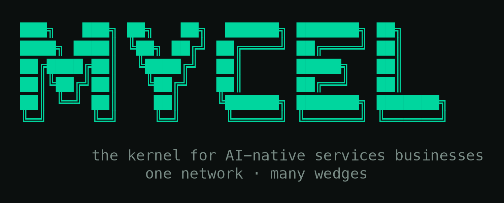

<p align="center">
  
</p>

<h3 align="center">The kernel for AI-native services businesses.</h3>
<p align="center"><em>One network · many wedges.</em></p>

---

> **Status: pre-alpha / concept.** Mycel is being *extracted* from real AI-native
> service businesses we run ourselves, not designed in a vacuum. Nothing here is
> stable yet. Watch the repo; don't depend on it.

## What this is

A new AI app is, underneath, a **harness**: a front-end and a back-end and a queue
wrapped around an agent that does real work. Founders keep rebuilding that same
plumbing, wedge after wedge.

Mycel is the reusable core of that plumbing, opinionated and grounded in
go-to-market. It handles the parts that are ~90% the same across every AI-native
services business, so a founder can wrap it in their own product, their own logic,
their own unfair advantage, and go.

**We build it by using it.** We run our own outcome-selling wedges on Mycel, keep
the ones that pull, and everything reusable gets extracted here in the open. The
data and the community compound. That is the whole strategy.

## What Mycel handles

- **The harness runtime** — runs agents (OpenCode) inside isolated sandboxes
  (Daytona), streams every event, enforces human approvals, validates outputs,
  stores artifacts, tracks cost.
- **Client connection** — connect an end-client's accounts, documents, and context;
  ground the agent in the knowledge around a specific wedge.
- **Go-to-market (founder-gated)** — find and reach the businesses a wedge serves,
  qualify, follow up. Gated to the founder, never exposed to the end client.
- **Frontend, as skills** — Mycel does not ship a UI package or SDK to import. It ships
  *skills* that teach the founder's coding agent (Claude Code / OpenCode) to generate a
  brand-fitting chat / streaming / approval UI against the event contract. The hard artifact
  is the contract, not the pixels.

## Architecture at a glance

Three layers, one task/event protocol. The seams are where the reusable kernel
gets cut out of each wedge.

```
  Founder's product (their frontend / backend / brand)
        │
        │  UI generated by Mycel frontend skills (against the event contract)
        │  (streaming events, logs, browser view, approvals, artifacts)
        ▼
  ┌───────────────────────────── Mycel core (headless) ─────────────────────────┐
  │  Task API  →  Queue  →  Workers  →  OpenCode-in-Daytona  →  typed event bus  │
  │  approvals · output validation · artifacts · cost · feedback loop           │
  └──────────────────────────────────────────────────────────────────────────────┘
        │                                   │
   LiteLLM (model routing)          GTM module (founder-gated:
                                     enrichment · outreach · scheduling)
```

Full architecture is under active engineering review — see `docs/ARCHITECTURE.md`.

## Why "Mycel"

Mycelium is one underground network that puts up many fruiting bodies. That is the
model: **one kernel and one data network, many wedge-businesses growing on top,
spreading horizontally.** Also reads as *my-cell* (the core unit) and *my-sell*
(the go-to-market engine) — kernel and distribution in one word.

## Principles

1. **Sell outcomes, not the kernel.** Revenue is proof. The kernel is a flywheel.
2. **Extract, don't design.** Generality is earned from ≥2 running wedges, never
   speculated up front.
3. **Serial before parallel.** Prove one wedge's full loop (find → deliver →
   measurably improve) before the next.
4. **Draft-and-approve first.** Trust is the gating feature; autonomy is earned.

## License

Licensing model is undecided and it matters (open-core vs. permissive vs.
source-available/BSL, given the hosted product). Do not assume a license until
`LICENSE` lands. See `docs/ARCHITECTURE.md` open questions.

---

<p align="center"><sub>github.com/mycelhq · mycel.dev</sub></p>
